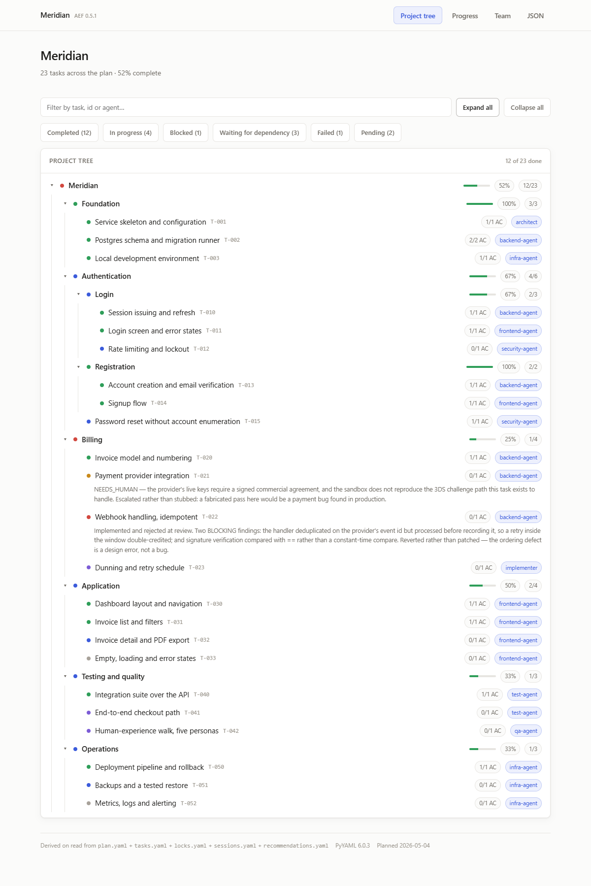
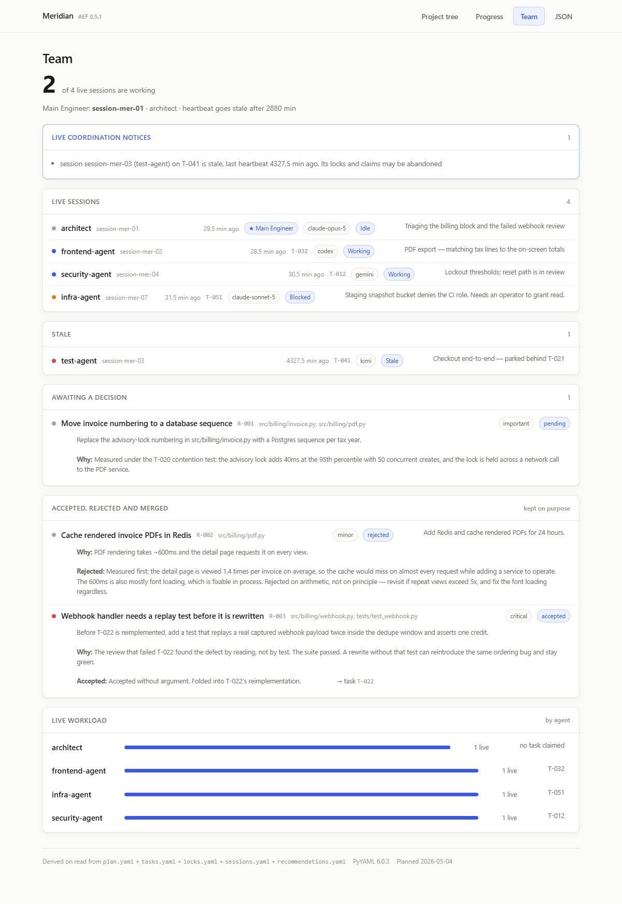
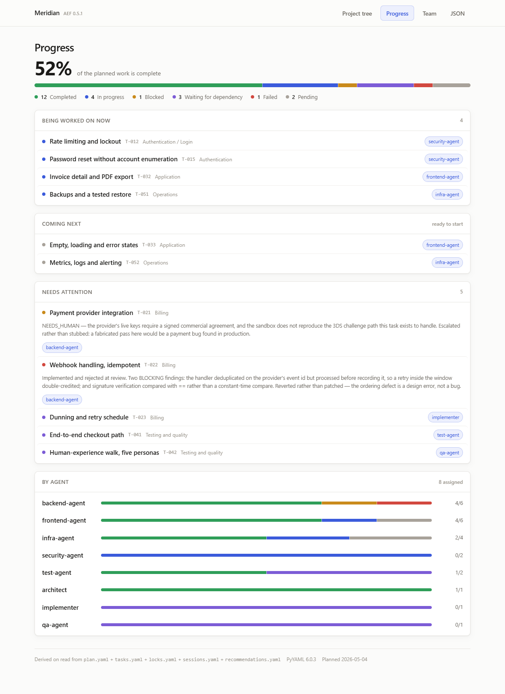

# AEF — Agentic Engineering Framework

[](https://github.com/Safu1islam/aef/actions/workflows/tests.yml)

**An open, tool-neutral operating standard for AI coding agents.**

Drop it into any repository and every agent — Claude Code, Codex, Cursor, Gemini, Kimi,
whatever ships next — works to the same process, writes to the same state, and reports
to the same standard.

MIT licensed. **No dependencies, no install step, no Python required to adopt it.**

---

## The problem

AI can write code. It cannot yet run a project.

Every new chat rediscovers the repository. Every tool invents its own architecture and
its own definition of "done". Mock data gets buried and never removed. An agent asked
for a latency-critical system reaches for whatever language it writes most fluently,
and you find out after the system exists. Tests are reported as passing when nothing
ran. A usage limit hits mid-task and a day of progress dies with the context window.

None of this is fixed by telling an agent to try harder. Each needs a mechanism, and an
artifact a human can check.

## What AEF does

| Failure | Mechanism |
|---|---|
| Every agent invents its own process | Constitution plus routing configuration as data |
| New chat rediscovers everything | Repository-resident state, decisions, domain memory |
| Wrong stack chosen by fluency | Selection gate requiring quantified constraints first |
| "It runs but nothing works" | Observable acceptance criteria before code; independent verification |
| Fake data indistinguishable from real | Fabrication registry, enforced at completion |
| Demo-grade where serious was needed | Mandatory quality dimensions per change class |
| Token burn, lost usage limits | Tiered loading, model tiering, checkpointed resumable state |
| Long sessions degrade | Session caps; continuity in files, not context |
| No accountability | Role, task, and model attribution on every commit |

## How it works

**Three layers.** The framework (`aef/`) is read-only and version-pinned. The project
constitution (`.ai/project.md`) holds domain facts. Project state (`.ai/state/`) is
written continuously by any agent. Projects cannot mutate the standard, so the standard
does not fork on contact with reality.

**Seven roles, not three hundred agents.** Orchestrator, analyst, architect,
implementer, reviewer, verifier, human-experience reviewer, domain steward. Any model
occupies any role by loading the constitution plus one role file. Expertise lives in
45 quality dimensions that load only when a change requires them.

**Configuration, not prose.** `routing.yaml` maps change classes to modes, roles, and
mandatory quality dimensions. Prose gets reinterpreted by every model that reads it.
YAML does not.

**Honest status, structurally.** Six verification statuses. `PASSED` requires that the
agent executed the check and observed success. `NOT_RUN` is acceptable and honest. There
is nowhere to be vague.

## Quickstart

Copy the framework into your project — it travels with the repository, so a
fresh clone already has its governance layer.

```bash
git clone --depth 1 https://github.com/Safu1islam/aef aef && rm -rf aef/.git
cp aef/adapters/CLAUDE.md .        # or AGENTS.md, .cursorrules, GEMINI.md
mkdir -p .ai/state/decisions .ai/memory/domains .ai/config
```

`aef/` is read-only from then on: configure through `.ai/config/overrides.yaml`,
and upgrade by replacing the directory. Full options and the project layout are
in [`install/BOOTSTRAP.md`](install/BOOTSTRAP.md).

**No Python needed to adopt AEF.** The standard is markdown and YAML — the
constitution, protocols, roles, routing table and schemas are read directly by
whatever agent you use. `tools/` is an optional convenience that reads and writes
the same state files, with no `pip install`, no lockfile and no third-party
import (CI fails the build if one appears). Drop it into a Rust, Go, TypeScript
or data project and none of them acquires a Python dependency.
See [`docs/NO-PYTHON.md`](docs/NO-PYTHON.md).

If you do use the tools: **Python 3.9 or newer**, measured — CI runs the suite
on 3.9, 3.10, 3.11, 3.12 and 3.13, on Linux, Windows and macOS, with and
without PyYAML.

Then, in your agent tool:

> Read aef/core/CONSTITUTION.md, then run aef/protocols/01-intake.md.

Full instructions: [`docs/QUICKSTART.md`](docs/QUICKSTART.md).

## See it before you install it

A fictional project ships with the framework, so the dashboard has something to
show on a machine that has never run AEF:

```bash
python tools/aef.py --root docs/example dashboard     # then open 127.0.0.1:7423
```

Read-only, localhost, no state written, nothing installed.

<picture>
  <source media="(prefers-color-scheme: dark)" srcset="docs/example/img/tree-dark.png">
  
</picture>

**The tree is the primary view.** Depth is whatever the project needs. Every
percentage is derived on read — none is a number someone typed. The blocked and
failed tasks carry their reasons where you see them, not in a log.

<picture>
  <source media="(prefers-color-scheme: dark)" srcset="docs/example/img/team-dark.png">
  
</picture>

**Who is actually working, right now** — derived from session heartbeats, not
from a status somebody remembered to set. One session has gone stale and its
claims are flagged as possibly abandoned. One agent is blocked, with the reason
a human needs. A rejected proposal is kept with its reasoning, so nobody
re-proposes it. Five sessions, four vendors, one set of files.

<picture>
  <source media="(prefers-color-scheme: dark)" srcset="docs/example/img/progress-dark.png">
  
</picture>

The same state as text, for agents and for people who would rather not open a
browser:

```console
$ python tools/aef.py --root docs/example progress

Meridian
Project Progress: 52%
  [##################----------------]

    12  completed
     4  in progress
     1  blocked
     3  waiting for dependency
     1  failed
     2  pending
  ----
    23  tasks in the plan
```

The tree is the primary view. Depth is whatever the project needs, and every
percentage is derived on read — nothing is a number someone typed:

```console
$ python tools/aef.py --root docs/example tree

Meridian  ·  52% (12/23)
|-- [x] Foundation  [100% 3/3]
|-- [~] Authentication  [67% 4/6]
|   |-- [~] Login  [67% 2/3]
|   |   |-- [x] Session issuing and refresh (T-010)     -> backend-agent
|   |   |-- [x] Login screen and error states (T-011)   -> frontend-agent
|   |   `-- [~] Rate limiting and lockout (T-012)       -> security-agent
|   `-- [x] Registration  [100% 2/2]
|-- [X] Billing  [25% 1/4]
|   |-- [x] Invoice model and numbering (T-020)         -> backend-agent
|   |-- [!] Payment provider integration (T-021)        -> backend-agent
|   |-- [X] Webhook handling, idempotent (T-022)        -> backend-agent
|   `-- [.] Dunning and retry schedule (T-023)          -> implementer
`-- ...
```

And who is actually working right now — derived from session heartbeats, not
from a status somebody remembered to set:

```console
$ python tools/aef.py --root docs/example team

Main Engineer: session-mer-01 (architect)

Live sessions (4):
  [idle    ] session-mer-01    architect
  [working ] session-mer-02    frontend-agent  -> T-032
  [working ] session-mer-04    security-agent  -> T-012
  [blocked ] session-mer-07    infra-agent     -> T-051
        blocked: Staging snapshot bucket denies the CI role. Needs an operator to grant read.

Stale (1):
  [stale   ] session-mer-03    test-agent      last beat 96 min ago

1 coordination notice(s):
  - session session-mer-03 (test-agent) on T-041 is stale. Its locks and claims may be abandoned
```

The example is deliberately **not** a happy path — it carries a failed review, a
blocked payment integration, a stale agent and a rejected proposal, because a
dashboard is only worth trusting once you have seen it deliver bad news. See
[`docs/example/`](docs/example/) for what each part demonstrates.


## Layout

```
core/        constitution, operating loop, non-negotiables
protocols/   intake, technology selection, discovery, planning,
             execution, verification, completion, skill generation
roles/       seven model-agnostic role contracts
config/      framework.yaml, routing.yaml, quality-dimensions.yaml
schemas/     task graph, fabrication registry, locks, domain memory
adapters/    entry stubs per tool
install/     bootstrap and upgrade
docs/        why, concepts, architecture, migration, no-python
tools/       OPTIONAL. stdlib-only CLI + dashboard over the same state
```

Everything above `tools/` is the standard, and needs no interpreter.

## Documentation

- [Why AEF exists](docs/WHY.md) — the nine failures, in detail
- [Concepts](docs/CONCEPTS.md) — layers, roles, dimensions, modes, registry
- [Quickstart](docs/QUICKSTART.md) — installation and first run
- [AI review request](docs/AI-REVIEW-REQUEST.md) — adversarial review prompt for any model
- [Architecture](docs/ARCHITECTURE.md) — what owns which fact, and why
- [Migration](docs/MIGRATION.md) — what an upgrade actually requires
- [Using AEF without Python](docs/NO-PYTHON.md) — the tooling is optional

## Status and honest gaps

v0.4.0. What it has earned since 0.1.0: a plan tree with derived progress, a
dashboard, agent assignment, live multi-agent coordination, and 109 tests that
are proven able to fail by sabotage rather than merely asserted.

What it has **not** earned:

- **Partial enforcement only.** `aef.py validate` checks the plan against the
  task graph, and the coordination checks report drift between state files.
  Nothing mechanically prevents an agent writing `PASSED` for a check it never
  ran. The standard raises the cost of dishonesty; it does not make it impossible.
- **Not battle-tested against a large legacy repository.** It has been run
  against one real project, continuously, by a small number of agents.
- **No genuinely heterogeneous fleet.** The coordination layer is designed to be
  vendor-neutral and nothing in it branches on vendor or model, but four agents
  from four vendors coordinating through these files has not been run.
- **Routing classes cover common web, service, and AI work.** Specialised
  domains — embedded, games, data engineering, scientific computing — need
  contributed classes.

## Contributing

Real-world failure reports are worth more than feature requests. If an agent operating
under AEF reported a false `PASSED`, shipped unregistered fabrication, or claimed
completion with blocking findings open, that is the single most valuable issue you can
file. See [`CONTRIBUTING.md`](CONTRIBUTING.md).

## Design principles

Configuration over prose. Data over documents. Evidence over assertion. Few roles, many
dimensions. State in files, not context. Honest status always.

## Licence

MIT — see [`LICENSE`](LICENSE).
